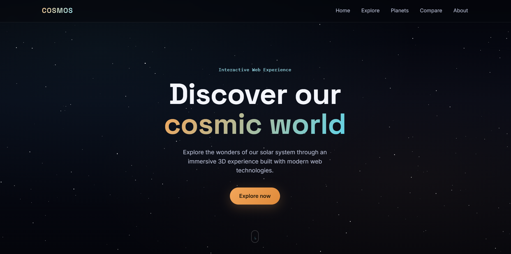
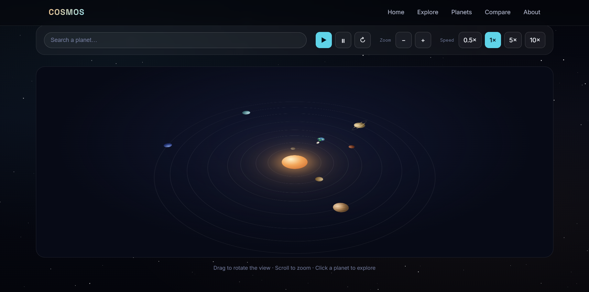
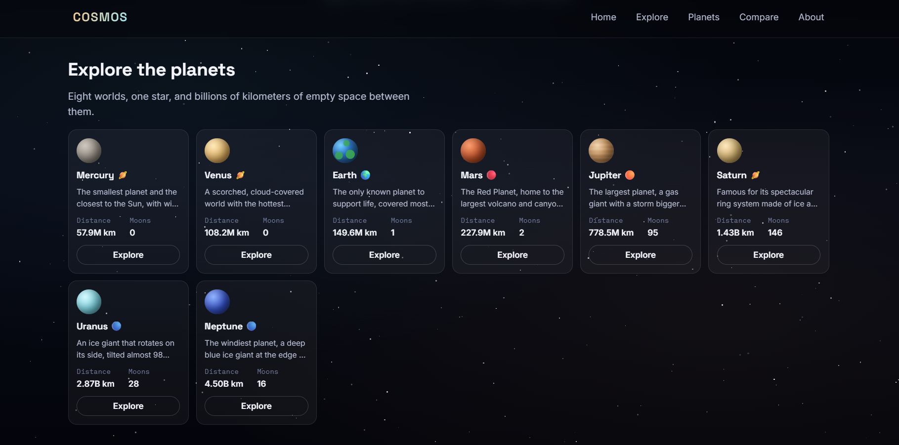
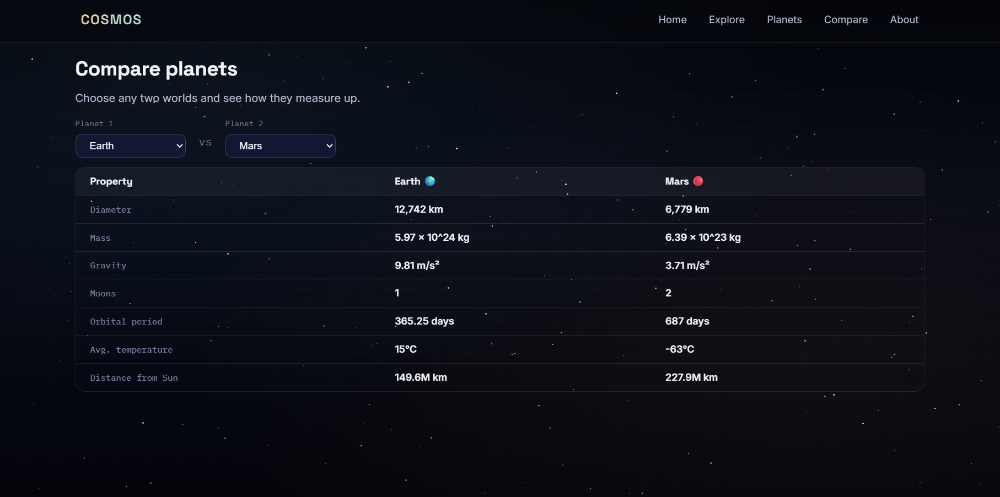

# 🌌 COSMOS — 3D Solar System Explorer

An interactive **3D Solar System Explorer** built using **HTML, CSS, and JavaScript** — with no external frameworks or dependencies.

Explore the planets, rotate and zoom the solar system, view planet information, search planets, and compare different worlds.

**Live Demo:** https://kaveeshamalindi.github.io/COSMOS-3D-Solar-System-Explorer/

<br>

<p align="center">
  
  
  
  
</p>

<br>

---

## ✨ Features

* 🪐 Interactive 3D Solar System
* 🖱️ Drag to rotate
* 🔍 Zoom in/out
* ▶️ Play / pause orbit animations
* ⚡ Change orbit speed
* 🔄 Reset controls
* 📖 Planet information panel
* 🔎 Planet search
* ⚖️ Planet comparison
* 📱 Responsive design
* ⭐ Animated starfield

---

## 🛠️ Technologies

* HTML5
* CSS3
* JavaScript (ES6+)
* CSS 3D Transforms & Animations

---

## 📁 Project Structure

```text
cosmos/
├── index.html
├── style.css
├── script.js
└── README.md
```

---

## 🚀 Run Locally

Clone the repository:

```bash
git clone https://github.com/your-username/cosmos-solar-system.git
```

Open the project folder and launch `index.html` in your browser.

You can also use **VS Code Live Server**.

---

## 🌍 Planets

Mercury • Venus • Earth • Mars • Jupiter • Saturn • Uranus • Neptune

---

## 🔮 Future Improvements

* Realistic planet textures
* Moon animations
* Asteroid belt
* Spacecraft exploration
* More detailed planetary data

---

⭐ If you like this project, consider giving the repository a star!
